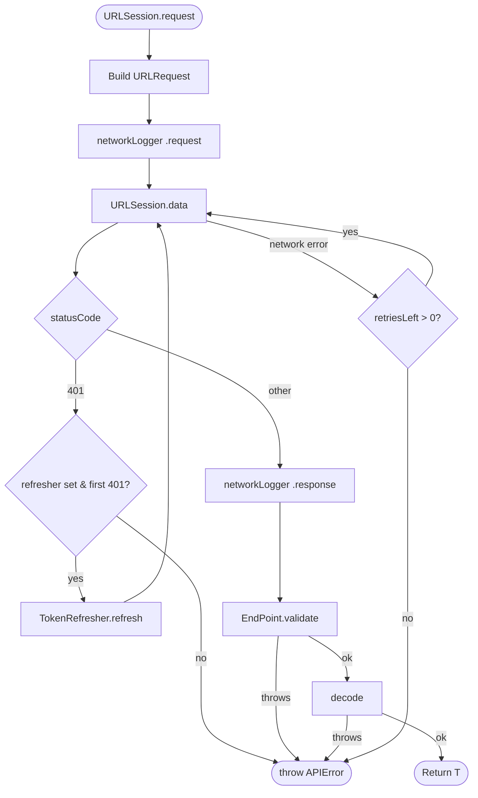
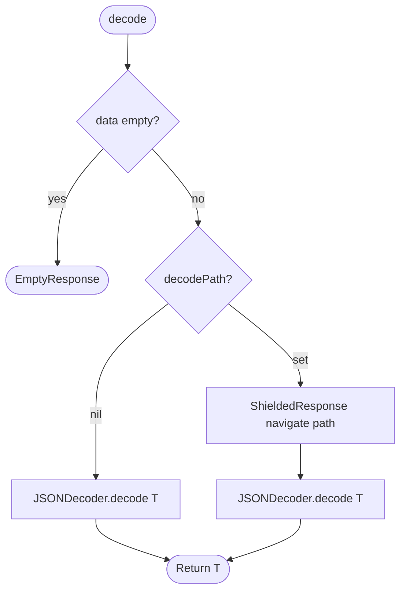

# JPNetworking

**[English](README.md) | [中文](README.zh.md)**

A lightweight Swift Package for reusable networking in Swift projects.

## Requirements

- Swift 6.2+
- iOS 17+ / macOS 14+

## Installation

```swift
// Package.swift
dependencies: [
    .package(url: "https://github.com/shinrenpan/JPNetworking", from: "1.0.0")
]
```

Or via Xcode: **File → Add Package Dependencies**.

---

## Flow

### Request



### Decode



---

## Setup

### 1. Configure EndPoint defaults

Add a project-level extension once. All endpoints inherit these defaults.

**HTTP status code backend** (success = 2xx):

```swift
extension EndPoint {
    var baseURL: String { "https://api.example.com" }
    var decodePath: [String]? { ["data"] }
    var headers: [String: String] {
        var h = ["Content-Type": "application/json"]
        if needToken { h["Authorization"] = "Bearer \(TokenManager.shared.token)" }
        return h
    }

    func validate(_ data: Data, _ response: HTTPURLResponse) throws -> Data {
        guard (200..<300).contains(response.statusCode) else {
            throw APIError.serverError(code: response.statusCode, message: "HTTP \(response.statusCode)")
        }
        return data
    }
}
```

**Custom code backend** (success = `code == 0`):

```swift
extension EndPoint {
    var baseURL: String { "https://api.example.com" }
    var decodePath: [String]? { ["data"] }
    var headers: [String: String] {
        var h = ["Content-Type": "application/json"]
        if needToken { h["Authorization"] = "Bearer \(TokenManager.shared.token)" }
        return h
    }

    func validate(_ data: Data, _ response: HTTPURLResponse) throws -> Data {
        struct Envelope: Decodable { let code: Int; let message: String }
        let envelope = try JSONDecoder().decode(Envelope.self, from: data)
        guard envelope.code == 0 else {
            throw APIError.serverError(code: envelope.code, message: envelope.message)
        }
        return data
    }
}
```

### 2. Define endpoints

Recommended: one struct per endpoint. Avoids large switch statements as the project grows.

```swift
struct ProfileEndPoint: EndPoint {
    let id: String
    var path: String { "/users/\(id)" }
    var method: APIMethod { .get }
}

struct LoginEndPoint: EndPoint {
    let email: String
    let password: String
    var path: String { "/auth/login" }
    var method: APIMethod { .post }
    var needToken: Bool { false }
    var body: Data? {
        try? JSONEncoder().encode(["email": email, "password": password])
    }
}
```

### 3. Configure TokenRefresher

Set once at app startup. All requests use it automatically.

```swift
URLSession.shared.tokenRefresher = TokenRefresher {
    let token: TokenDTO = try await URLSession.shared.request(RefreshEndPoint())
    TokenManager.shared.save(token.accessToken)
}
```

---

## Scenarios

### Making a Request

```swift
// GET — authenticated (needToken defaults to true)
let profile: ProfileDTO = try await URLSession.shared.request(ProfileEndPoint(id: "123"))

// POST with body
let token: TokenDTO = try await URLSession.shared.request(
    LoginEndPoint(email: "joe@example.com", password: "secret")
)

// Public endpoint (needToken: false)
let feed: FeedDTO = try await URLSession.shared.request(PublicFeedEndPoint())
```

---

### Token Auto-Refresh (401)

When a request receives 401, `TokenRefresher` runs the refresh handler **once** and retries automatically. No extra code needed at the call site — just set `tokenRefresher` in setup.

If refresh fails, or the retried request returns 401 again, `APIError.unAuthorized` is thrown.

```swift
// This retries automatically if 401 is received
let profile: ProfileDTO = try await URLSession.shared.request(ProfileEndPoint(id: "123"))
```

---

### Concurrent 401s

When multiple requests hit 401 at the same time, `TokenRefresher` ensures only **one** refresh call runs. The others wait and retry together once it completes.

```swift
// Both hit 401 at the same time
async let api1: ProfileDTO = URLSession.shared.request(ProfileEndPoint(id: "123"))
async let api2: FeedDTO    = URLSession.shared.request(FeedEndPoint())

// api1 triggers refresh, api2 waits — both retry with the new token
let (profile, feed) = try await (api1, api2)
```

---

### Unreliable Backend Data (SafeBox)

Backend sends the wrong type for a field (e.g. `"42"` instead of `42`), or omits fields entirely. `SafeBox` rescues the value automatically. On failure, `wrappedValue` is `nil`.

```swift
struct UserDTO: Decodable {
    @SafeBox var age: Int?      // backend may send "30" or omit the field
    @SafeBox var name: String?  // backend may send 0 or null
    @SafeBox var score: Double? // backend may send "9.5"
    @SafeBox var active: Bool?  // backend may send "true", "1", or 1
}
```

**Type rescue coverage:**

| Field type | Backend sends | Result |
|---|---|---|
| `Int` | `"42"` | `42` |
| `Int` | `3.9` | `3` |
| `Double` | `"3.14"` | `3.14` |
| `Double` | `2` | `2.0` |
| `String` | `123` | `"123"` |
| `Bool` | `"true"` / `"1"` / `"yes"` | `true` |
| `Bool` | `1` | `true` |
| Any | `null` or missing key | `nil` |
| Any | unrecognized value | `nil` |

**Handling nil when converting to domain model:**

```swift
// Option A — surface data quality errors
func toDomain() -> User? {
    guard let age, let name else { return nil }  // nil → dataQualityError
    return User(age: age, name: name)
}

// Option B — always show data with fallback
func toDomain() -> User? {
    User(age: age ?? 0, name: name ?? "Unknown")
}
```

---

### Array with Corrupt Elements (SafeArray)

Backend returns an array where some elements are malformed. `SafeArray` skips corrupt elements instead of failing the entire decode.

```swift
struct FeedDTO: Decodable {
    @SafeArray var items: [ItemDTO]
}
```

| Backend sends | Result |
|---|---|
| `[item1, item2, item3]` | `[item1, item2, item3]` |
| `[item1, 💥badData, item3]` | `[item1, item3]` |
| missing key | `[]` |

---

### Custom JSON Path

Some endpoints nest the payload deeper than the project default.

```swift
// Default decodePath is ["data"] — decodes from:
// { "data": { "id": 1, ... } }

// Override per endpoint:
struct FeedEndPoint: EndPoint {
    var decodePath: [String]? { ["data", "list"] }
    // decodes from: { "data": { "list": [...] } }
}

// Decode from root (no nesting):
struct PingEndPoint: EndPoint {
    var decodePath: [String]? { nil }
    // decodes from: { "status": "ok" }
}
```

---

### No Response Body (204)

Some endpoints return no body (e.g. DELETE, logout). Use `EmptyResponse` as the return type.

```swift
let _: EmptyResponse = try await URLSession.shared.request(DeletePostEndPoint(id: "42"))
let _: EmptyResponse = try await URLSession.shared.request(LogoutEndPoint())
```

---

### File Upload

Use `MultipartBuilder` to construct the request body. Store the builder in the endpoint to keep the boundary consistent between `headers` and `body`.

```swift
struct UploadAvatarEndPoint: EndPoint {
    private let builder: MultipartBuilder

    init(image: Data) {
        var b = MultipartBuilder()
        b.addFile(name: "avatar", filename: "avatar.jpg", mimeType: "image/jpeg", data: image)
        self.builder = b
    }

    var path: String { "/user/avatar" }
    var method: APIMethod { .post }
    var headers: [String: String] { ["Content-Type": builder.contentType] }
    var body: Data? { builder.build() }
}
```

Attach text fields alongside files:

```swift
b.addField(name: "caption", value: "My photo")
b.addFile(name: "photo", filename: "photo.jpg", mimeType: "image/jpeg", data: imageData)
```

---

### Network Retry

Set `retryCount` on an endpoint to retry automatically on transient network errors (timeout, connection lost). `401`, validation errors, and decoding errors are never retried.

```swift
struct WeatherEndPoint: EndPoint {
    var retryCount: Int { 2 }  // retries up to 2 times on network failure
}
```

---

### Environment Switching

```swift
extension EndPoint {
    var baseURL: String {
        #if DEBUG
        "https://staging.api.example.com"
        #else
        "https://api.example.com"
        #endif
    }
}
```

---

### Debug Logging

Wire `networkLogger` to OSLog or any logging system. Receives events before and after every request.

```swift
import OSLog

let logger = Logger(subsystem: "com.example.app", category: "Network")

URLSession.shared.networkLogger = { event in
    switch event {
    case .request(let req):
        logger.debug("→ \(req.httpMethod ?? "") \(req.url?.absoluteString ?? "")")
    case .response(let data, let res):
        logger.debug("← \(res.statusCode) (\(data.count) bytes)")
    case .error(let error):
        logger.error("✗ \(error)")
    }
}
```

---

### Cancel a Request

```swift
let task = Task {
    let feed: FeedDTO = try await URLSession.shared.request(FeedEndPoint())
}

// Cancel from outside (e.g. when user leaves the page)
task.cancel()
```

---

### Unit Testing with Mock

Use `URLProtocol` to intercept requests without hitting the real network.

```swift
class MockURLProtocol: URLProtocol {
    static var handler: ((URLRequest) -> (Data, HTTPURLResponse))?

    override class func canInit(with request: URLRequest) -> Bool { true }
    override class func canonicalRequest(for request: URLRequest) -> URLRequest { request }

    override func startLoading() {
        guard let (data, response) = Self.handler?(request) else { return }
        client?.urlProtocol(self, didReceive: response, cacheStoragePolicy: .notAllowed)
        client?.urlProtocol(self, didLoad: data)
        client?.urlProtocolDidFinishLoading(self)
    }

    override func stopLoading() {}
}
```

```swift
// In your test:
let config = URLSessionConfiguration.ephemeral
config.protocolClasses = [MockURLProtocol.self]
let session = URLSession(configuration: config)

MockURLProtocol.handler = { _ in
    let json = #"{"data": {"id": 1, "name": "Joe"}}"#
    let response = HTTPURLResponse(
        url: URL(string: "https://example.com")!,
        statusCode: 200,
        httpVersion: nil,
        headerFields: nil
    )!
    return (Data(json.utf8), response)
}

let user: UserDTO = try await session.request(ProfileEndPoint(id: "1"))
```

---

### SSL Pinning

JPNetworking works with any `URLSession` instance. To enable SSL Pinning, create a custom session with a `URLSessionDelegate` and use it in place of `URLSession.shared`.

```swift
class SSLPinningDelegate: NSObject, URLSessionDelegate {
    func urlSession(
        _ session: URLSession,
        didReceive challenge: URLAuthenticationChallenge,
        completionHandler: @escaping (URLSession.AuthChallengeDisposition, URLCredential?) -> Void
    ) {
        guard challenge.protectionSpace.authenticationMethod == NSURLAuthenticationMethodServerTrust,
              let serverTrust = challenge.protectionSpace.serverTrust else {
            completionHandler(.cancelAuthenticationChallenge, nil)
            return
        }
        // Compare against your pinned certificate or public key here
        let credential = URLCredential(trust: serverTrust)
        completionHandler(.useCredential, credential)
    }
}
```

```swift
// Create once at app startup
let pinningSession = URLSession(
    configuration: .default,
    delegate: SSLPinningDelegate(),
    delegateQueue: nil
)

// All JPNetworking features work as usual
pinningSession.tokenRefresher = TokenRefresher { ... }
pinningSession.networkLogger = { ... }

// Use this session for all requests
let profile: ProfileDTO = try await pinningSession.request(ProfileEndPoint(id: "123"))
```

The internal `URLSession.data(for:)` call automatically triggers the delegate's `didReceive challenge` — no changes to the package required.

---

## Error Handling

```swift
do {
    let profile: ProfileDTO = try await URLSession.shared.request(ProfileEndPoint(id: "123"))
} catch APIError.unAuthorized {
    // Token refresh failed, or no refresher was provided → redirect to login
} catch APIError.serverError(let code, let message) {
    // Backend returned a business error → show message to user
} catch APIError.dataQualityError {
    // toDomain() returned nil → log for investigation, show fallback UI
} catch APIError.custom(let message) {
    // Miscellaneous errors raised manually
} catch APIError.someError(let error) {
    // Network failure, timeout, or decoding error → show retry prompt
}
```

---

## License

MIT © 2026 Shinren Pan
