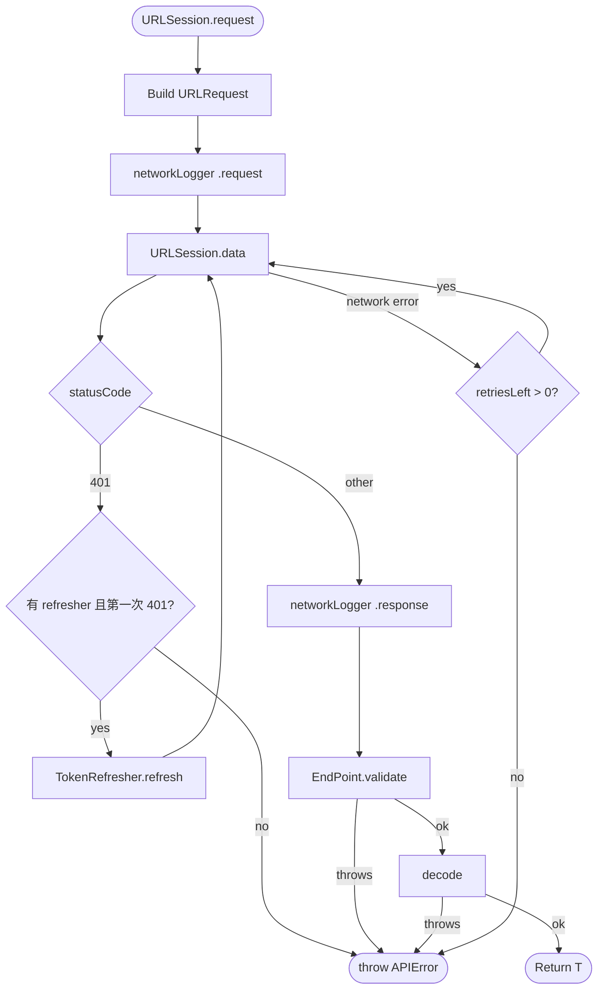
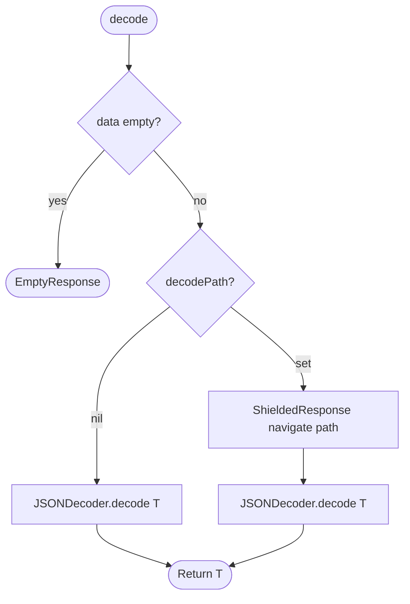

# JPNetworking

**[English](README.md) | [中文](README.zh.md)**

輕量的 Swift Package，為 Swift 專案提供可重用的網路層。

## 系統需求

- Swift 6.2+
- iOS 17+ / macOS 14+

## 安裝

```swift
// Package.swift
dependencies: [
    .package(url: "https://github.com/shinrenpan/JPNetworking", from: "0.1.0")
]
```

或在 Xcode：**File → Add Package Dependencies**。

---

## 流程圖

### 請求流程



### 解碼流程



---

## 設定

### 1. 設定 EndPoint 預設值

在專案層級加一個 extension，所有 endpoint 自動繼承這些預設值。

**HTTP status code 後端**（2xx = 成功）：

```swift
extension EndPoint {
    var baseURL: String { "https://api.example.com" }
    var decodePath: [String]? { ["data"] }
    var headers: [String: String] {
        var h = ["Content-Type": "application/json"]
        if needToken { h["Authorization"] = "Bearer \(TokenManager.shared.token)" }
        return h
    }

    func validate(_ data: Data, _ response: HTTPURLResponse) throws -> Data {
        guard (200..<300).contains(response.statusCode) else {
            throw APIError.serverError(code: response.statusCode, message: "HTTP \(response.statusCode)")
        }
        return data
    }
}
```

**Custom code 後端**（`code == 0` = 成功）：

```swift
extension EndPoint {
    var baseURL: String { "https://api.example.com" }
    var decodePath: [String]? { ["data"] }
    var headers: [String: String] {
        var h = ["Content-Type": "application/json"]
        if needToken { h["Authorization"] = "Bearer \(TokenManager.shared.token)" }
        return h
    }

    func validate(_ data: Data, _ response: HTTPURLResponse) throws -> Data {
        struct Envelope: Decodable { let code: Int; let message: String }
        let envelope = try JSONDecoder().decode(Envelope.self, from: data)
        guard envelope.code == 0 else {
            throw APIError.serverError(code: envelope.code, message: envelope.message)
        }
        return data
    }
}
```

### 2. 定義 Endpoint

建議每個 endpoint 獨立一個 struct，避免專案規模增長後出現龐大的 switch。

```swift
struct ProfileEndPoint: EndPoint {
    let id: String
    var path: String { "/users/\(id)" }
    var method: APIMethod { .get }
}

struct LoginEndPoint: EndPoint {
    let email: String
    let password: String
    var path: String { "/auth/login" }
    var method: APIMethod { .post }
    var needToken: Bool { false }
    var body: Data? {
        try? JSONEncoder().encode(["email": email, "password": password])
    }
}
```

### 3. 設定 TokenRefresher

App 啟動時設定一次，所有請求自動套用。

```swift
URLSession.shared.tokenRefresher = TokenRefresher {
    let token: TokenDTO = try await URLSession.shared.request(RefreshEndPoint())
    TokenManager.shared.save(token.accessToken)
}
```

---

## 情境

### 發送請求

```swift
// GET — 需要 token（needToken 預設為 true）
let profile: ProfileDTO = try await URLSession.shared.request(ProfileEndPoint(id: "123"))

// POST with body
let token: TokenDTO = try await URLSession.shared.request(
    LoginEndPoint(email: "joe@example.com", password: "secret")
)

// 公開 endpoint（needToken: false）
let feed: FeedDTO = try await URLSession.shared.request(PublicFeedEndPoint())
```

---

### Token 自動刷新（401）

收到 401 時，`TokenRefresher` 自動執行刷新**一次**並重試，call site 不需要任何額外程式碼。

刷新失敗，或重試後再次收到 401，拋出 `APIError.unAuthorized`。

```swift
// 收到 401 時自動刷新重試
let profile: ProfileDTO = try await URLSession.shared.request(ProfileEndPoint(id: "123"))
```

---

### 多個 API 同時 401（Race Condition）

多個請求同時收到 401 時，`TokenRefresher` 確保只有**一個** refresh 請求執行，其餘等待完成後一起 retry。

```swift
// 兩個請求同時收到 401
async let api1: ProfileDTO = URLSession.shared.request(ProfileEndPoint(id: "123"))
async let api2: FeedDTO    = URLSession.shared.request(FeedEndPoint())

// api1 觸發 refresh，api2 等待 — 都拿到新 token 後一起 retry
let (profile, feed) = try await (api1, api2)
```

---

### 後端資料型別不一致（SafeBox）

後端對某個欄位回傳了錯誤型別（如 `"42"` 而非 `42`），或乾脆省略欄位。`SafeBox` 自動修復，失敗時 `wrappedValue` 為 `nil`。

```swift
struct UserDTO: Decodable {
    @SafeBox var age: Int?      // 後端可能回傳 "30" 或省略
    @SafeBox var name: String?  // 後端可能回傳 0 或 null
    @SafeBox var score: Double? // 後端可能回傳 "9.5"
    @SafeBox var active: Bool?  // 後端可能回傳 "true"、"1" 或 1
}
```

**Type rescue 涵蓋範圍：**

| 欄位型別 | 後端回傳 | 結果 |
|---|---|---|
| `Int` | `"42"` | `42` |
| `Int` | `3.9` | `3` |
| `Double` | `"3.14"` | `3.14` |
| `Double` | `2` | `2.0` |
| `String` | `123` | `"123"` |
| `Bool` | `"true"` / `"1"` / `"yes"` | `true` |
| `Bool` | `1` | `true` |
| 任何型別 | `null` 或欄位缺失 | `nil` |
| 任何型別 | 無法辨識的值 | `nil` |

**轉換 domain model 時處理 nil：**

```swift
// 方案 A — 浮出資料品質錯誤
func toDomain() -> User? {
    guard let age, let name else { return nil }  // nil → dataQualityError
    return User(age: age, name: name)
}

// 方案 B — 永遠顯示資料，使用兜底值
func toDomain() -> User? {
    User(age: age ?? 0, name: name ?? "Unknown")
}
```

---

### 陣列中有壞資料（SafeArray）

後端回傳的陣列中有部分元素格式錯誤。`SafeArray` 跳過壞元素，不影響其餘資料。

```swift
struct FeedDTO: Decodable {
    @SafeArray var items: [ItemDTO]
}
```

| 後端回傳 | 結果 |
|---|---|
| `[item1, item2, item3]` | `[item1, item2, item3]` |
| `[item1, 💥壞資料, item3]` | `[item1, item3]` |
| 欄位缺失 | `[]` |

---

### 特殊 JSON 路徑

部分 endpoint 的 payload 巢狀深度與專案預設不同。

```swift
// 專案預設 decodePath 為 ["data"]，解碼自：
// { "data": { "id": 1, ... } }

// 針對特定 endpoint 覆寫：
struct FeedEndPoint: EndPoint {
    var decodePath: [String]? { ["data", "list"] }
    // 解碼自：{ "data": { "list": [...] } }
}

// 從根部解碼（無巢狀）：
struct PingEndPoint: EndPoint {
    var decodePath: [String]? { nil }
    // 解碼自：{ "status": "ok" }
}
```

---

### 後端不回 Body（204）

部分 endpoint（如 DELETE、登出）不回傳 body。使用 `EmptyResponse` 作為回傳型別。

```swift
let _: EmptyResponse = try await URLSession.shared.request(DeletePostEndPoint(id: "42"))
let _: EmptyResponse = try await URLSession.shared.request(LogoutEndPoint())
```

---

### 上傳檔案

使用 `MultipartBuilder` 組合請求 body。將 builder 存在 endpoint 裡，確保 `headers` 和 `body` 使用相同的 boundary。

```swift
struct UploadAvatarEndPoint: EndPoint {
    private let builder: MultipartBuilder

    init(image: Data) {
        var b = MultipartBuilder()
        b.addFile(name: "avatar", filename: "avatar.jpg", mimeType: "image/jpeg", data: image)
        self.builder = b
    }

    var path: String { "/user/avatar" }
    var method: APIMethod { .post }
    var headers: [String: String] { ["Content-Type": builder.contentType] }
    var body: Data? { builder.build() }
}
```

同時附加文字欄位：

```swift
b.addField(name: "caption", value: "我的照片")
b.addFile(name: "photo", filename: "photo.jpg", mimeType: "image/jpeg", data: imageData)
```

---

### 網路不穩自動重試

在 endpoint 設定 `retryCount`，遇到暫時性網路錯誤時自動重試。`401`、validate 錯誤、解碼錯誤都不會重試。

```swift
struct WeatherEndPoint: EndPoint {
    var retryCount: Int { 2 }  // 網路失敗時最多重試 2 次
}
```

---

### 環境切換

```swift
extension EndPoint {
    var baseURL: String {
        #if DEBUG
        "https://staging.api.example.com"
        #else
        "https://api.example.com"
        #endif
    }
}
```

---

### Debug Logging

將 `networkLogger` 接到 OSLog 或任何 logging 系統，每個 request 前後都會收到事件。

```swift
import OSLog

let logger = Logger(subsystem: "com.example.app", category: "Network")

URLSession.shared.networkLogger = { event in
    switch event {
    case .request(let req):
        logger.debug("→ \(req.httpMethod ?? "") \(req.url?.absoluteString ?? "")")
    case .response(let data, let res):
        logger.debug("← \(res.statusCode) (\(data.count) bytes)")
    case .error(let error):
        logger.error("✗ \(error)")
    }
}
```

---

### 取消請求

```swift
let task = Task {
    let feed: FeedDTO = try await URLSession.shared.request(FeedEndPoint())
}

// 從外部取消（例如使用者離開頁面時）
task.cancel()
```

---

### 單元測試 Mock

使用 `URLProtocol` 攔截請求，不需要打真實網路。

```swift
class MockURLProtocol: URLProtocol {
    static var handler: ((URLRequest) -> (Data, HTTPURLResponse))?

    override class func canInit(with request: URLRequest) -> Bool { true }
    override class func canonicalRequest(for request: URLRequest) -> URLRequest { request }

    override func startLoading() {
        guard let (data, response) = Self.handler?(request) else { return }
        client?.urlProtocol(self, didReceive: response, cacheStoragePolicy: .notAllowed)
        client?.urlProtocol(self, didLoad: data)
        client?.urlProtocolDidFinishLoading(self)
    }

    override func stopLoading() {}
}
```

```swift
// 測試中使用：
let config = URLSessionConfiguration.ephemeral
config.protocolClasses = [MockURLProtocol.self]
let session = URLSession(configuration: config)

MockURLProtocol.handler = { _ in
    let json = #"{"data": {"id": 1, "name": "Joe"}}"#
    let response = HTTPURLResponse(
        url: URL(string: "https://example.com")!,
        statusCode: 200,
        httpVersion: nil,
        headerFields: nil
    )!
    return (Data(json.utf8), response)
}

let user: UserDTO = try await session.request(ProfileEndPoint(id: "1"))
```

---

### SSL Pinning

JPNetworking 可以搭配任何 `URLSession` instance 使用。需要 SSL Pinning 時，建一個帶 `URLSessionDelegate` 的 custom session 取代 `URLSession.shared` 即可。

```swift
class SSLPinningDelegate: NSObject, URLSessionDelegate {
    func urlSession(
        _ session: URLSession,
        didReceive challenge: URLAuthenticationChallenge,
        completionHandler: @escaping (URLSession.AuthChallengeDisposition, URLCredential?) -> Void
    ) {
        guard challenge.protectionSpace.authenticationMethod == NSURLAuthenticationMethodServerTrust,
              let serverTrust = challenge.protectionSpace.serverTrust else {
            completionHandler(.cancelAuthenticationChallenge, nil)
            return
        }
        // 在這裡比對你的 pinned certificate 或 public key
        let credential = URLCredential(trust: serverTrust)
        completionHandler(.useCredential, credential)
    }
}
```

```swift
// App 啟動時建一次
let pinningSession = URLSession(
    configuration: .default,
    delegate: SSLPinningDelegate(),
    delegateQueue: nil
)

// 所有 JPNetworking 功能正常運作
pinningSession.tokenRefresher = TokenRefresher { ... }
pinningSession.networkLogger = { ... }

// 用這個 session 發所有請求
let profile: ProfileDTO = try await pinningSession.request(ProfileEndPoint(id: "123"))
```

內部的 `URLSession.data(for:)` 會自動觸發 delegate 的 `didReceive challenge`，package 不需要任何改動。

---

## 錯誤處理

```swift
do {
    let profile: ProfileDTO = try await URLSession.shared.request(ProfileEndPoint(id: "123"))
} catch APIError.unAuthorized {
    // Token 刷新失敗，或未設定 tokenRefresher → 導回登入頁
} catch APIError.serverError(let code, let message) {
    // 後端回傳業務錯誤 → 顯示錯誤訊息
} catch APIError.dataQualityError {
    // toDomain() 回傳 nil → 記錄 log，顯示 fallback UI
} catch APIError.custom(let message) {
    // 手動拋出的雜項錯誤
} catch APIError.someError(let error) {
    // 網路失敗、逾時或解碼錯誤 → 顯示重試提示
}
```

---

## 授權

MIT © 2026 Shinren Pan
